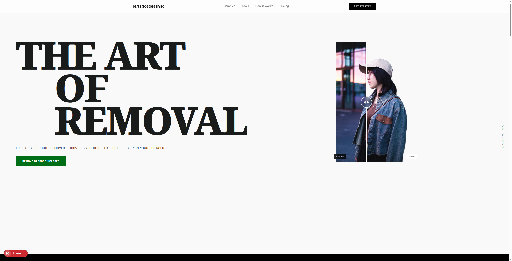

<p align="center">
  
</p>

<h1 align="center">Backgrone</h1>

<p align="center">
  <strong>Background Gone</strong> — Free, privacy-first AI background removal that runs 100% in your browser.
</p>

<p align="center">
  <a href="https://backgrone.app">Live Demo</a> &middot;
  <a href="#features">Features</a> &middot;
  <a href="#getting-started">Get Started</a> &middot;
  <a href="#self-hosting">Self-Hosting</a>
</p>

<p align="center">
  
  
  
  
  
</p>

---



## Why Backgrone?

Most background removal tools upload your images to remote servers. Backgrone is different — **every pixel is processed locally in your browser** via WebAssembly and ONNX Runtime. Your images never leave your device.

- No server uploads. No cloud dependency. No signup.
- Works offline after the first model download.
- Free forever with no watermarks.

---

## Features

| Feature | Description |
|---------|-------------|
| **3 AI Engines** | ISNet Precision (fp16, ~84MB), ISNet Lightweight (uint8, ~42MB), RMBG-1.4 (~44MB) |
| **100% Local** | All inference runs client-side via WASM/WebGPU — zero data leaves your device |
| **Batch Processing** | Remove backgrounds from up to 20 images at once, download as ZIP |
| **Background Replace** | Transparent, solid color, gradient, or custom image backgrounds |
| **Engine Arena** | Compare all 3 engines side-by-side on the same image |
| **Before/After Slider** | Interactive comparison slider on landing page and samples |
| **Drag & Drop** | Drop images anywhere on any page to start processing |
| **Clipboard Paste** | Ctrl+V to paste images directly from clipboard |
| **Keyboard Shortcuts** | Ctrl+S download, Ctrl+Z undo background, Esc cancel |
| **Offline Capable** | Models cached in IndexedDB after first download |
| **SEO Optimized** | Dynamic sitemap, robots.txt, structured data, Open Graph |
| **Blog** | Technical MDX articles about the technology |

---

## Tech Stack

| Layer | Technology |
|-------|-----------|
| Framework | [Next.js 16](https://nextjs.org) (App Router, React Compiler) |
| Language | TypeScript 5 |
| Styling | Tailwind CSS 4 |
| Animations | [Motion](https://motion.dev) (Framer Motion) |
| ML Engine A | [@imgly/background-removal](https://github.com/nicolo-ribaudo/background-removal-js) (ISNet fp16 / uint8) |
| ML Engine B | [@huggingface/transformers](https://github.com/huggingface/transformers.js) (RMBG-1.4) |
| ML Runtime | ONNX Runtime Web (WASM + WebGPU) |
| Concurrency | Web Workers |
| Caching | IndexedDB |
| Blog | MDX via next-mdx-remote |
| Comparison | react-compare-slider |
| ZIP | JSZip |
| Testing | Vitest + Testing Library |

---

## Getting Started

### Prerequisites

- **Node.js** 18.17+
- **npm** 9+

### Installation

```bash
git clone https://github.com/ABCDullahh/backgrone.git
cd backgrone
npm install
```

### Development

```bash
npm run dev
```

Open [http://localhost:3000](http://localhost:3000).

### Production Build

```bash
npm run build
npm run start
```

### Testing

```bash
npm run test          # run once
npm run test:watch    # watch mode
```

### Linting

```bash
npm run lint
```

---

## Project Structure

```
src/
├── app/
│   ├── (app)/              # Client-rendered pages
│   │   ├── editor/         # Main background removal tool
│   │   └── samples/        # Sample showcase + Engine Arena
│   ├── (marketing)/        # Static/SSG pages
│   │   ├── about/          # Brand philosophy
│   │   ├── blog/[slug]/    # MDX blog articles
│   │   ├── how-it-works/   # Technical deep dive
│   │   ├── pricing/        # Pricing page
│   │   ├── privacy/        # Privacy policy
│   │   ├── terms/          # Terms of service
│   │   └── video/          # Video BG removal (coming soon)
│   ├── layout.tsx          # Root layout + metadata
│   ├── robots.ts           # Dynamic robots.txt
│   └── sitemap.ts          # Dynamic sitemap.xml
├── components/
│   ├── editor/             # EditorLayout, UploadZone, ResultView, BatchQueue
│   ├── landing/            # Hero, LiveDemo, Features, FAQ sections
│   ├── layout/             # NavBar, Footer, GlobalDropZone
│   ├── samples/            # SampleShowcase, EngineArena
│   └── ui/                 # Shared UI primitives
├── content/blog/           # MDX blog posts
├── lib/
│   ├── ml/                 # ML processing layer
│   │   └── engines/        # 3 engine implementations
│   ├── hooks/              # React hooks (useBackgroundRemoval, useModelManager, etc.)
│   ├── utils/              # Canvas compositing, download helpers
│   └── data/               # Static data (samples)
├── workers/                # Web Worker for ML inference
└── types/                  # TypeScript type definitions
```

---

## Pages

| Route | Description |
|-------|-------------|
| `/` | Landing page — hero, live demo, features, use cases, FAQ |
| `/editor` | Main background removal tool with engine selection |
| `/samples` | Sample showcase + Engine Arena comparison |
| `/pricing` | Free forever pricing page |
| `/how-it-works` | 3-step process + technical architecture |
| `/blog` | Technical articles |
| `/blog/[slug]` | Individual blog post |
| `/about` | Brand philosophy + tech credits |
| `/video` | Video BG removal (coming soon) |
| `/privacy` | Privacy policy |
| `/terms` | Terms of service |

---

## How It Works

```
┌──────────┐    ┌───────────┐    ┌──────────────┐    ┌──────────┐
│  Upload   │───>│ Web Worker │───>│ ONNX Runtime │───>│ Download │
│ (Browser) │    │  Thread    │    │ (WASM/WebGPU)│    │   PNG    │
└──────────┘    └───────────┘    └──────────────┘    └──────────┘
```

1. **Upload** — Drag-drop, click, or paste an image (JPEG, PNG, WebP, HEIC)
2. **Process** — AI model runs in a Web Worker via WASM/WebGPU, keeping the UI responsive
3. **Download** — Get a lossless transparent PNG with optional background replacement

The AI model (~42-84MB depending on engine) downloads once and is cached in IndexedDB for instant loading on subsequent visits.

---

## Self-Hosting

Backgrone is designed to be self-hosted. It requires no backend, database, or API keys.

### Docker

```dockerfile
FROM node:18-alpine AS builder
WORKDIR /app
COPY package*.json ./
RUN npm ci
COPY . .
RUN npm run build

FROM node:18-alpine AS runner
WORKDIR /app
COPY --from=builder /app/.next/standalone ./
COPY --from=builder /app/.next/static ./.next/static
COPY --from=builder /app/public ./public
EXPOSE 3000
CMD ["node", "server.js"]
```

### Required Headers

Backgrone uses `SharedArrayBuffer` for WASM multi-threading. Your server must return these headers:

```
Cross-Origin-Embedder-Policy: credentialless
Cross-Origin-Opener-Policy: same-origin
```

These are already configured in `next.config.ts`.

### Nginx Reverse Proxy

```nginx
server {
    listen 443 ssl http2;
    server_name backgrone.yourdomain.com;

    location / {
        proxy_pass http://localhost:3000;
        proxy_set_header Host $host;
        proxy_set_header X-Real-IP $remote_addr;

        # Required for SharedArrayBuffer
        add_header Cross-Origin-Embedder-Policy "credentialless" always;
        add_header Cross-Origin-Opener-Policy "same-origin" always;
    }
}
```

---

## Design System

**Aura Brutalist-Editorial** — A high-contrast design language featuring:

- Monochrome palette with Electric Green (`#006e16`) accent
- Zero border-radius across all components
- Typography: Noto Serif (headlines), Inter (body), Space Grotesk (labels)
- Glassmorphism navbar with backdrop-blur
- Scroll-triggered animations with `prefers-reduced-motion` support

---

## Browser Support

| Browser | Minimum | WebGPU |
|---------|---------|--------|
| Chrome | 91+ | 113+ |
| Edge | 91+ | 113+ |
| Firefox | 89+ | Nightly |
| Safari | 16.4+ | 18+ |

All engines fall back to WASM when WebGPU is unavailable.

---

## Performance

| Metric | Value |
|--------|-------|
| Lighthouse Performance | 95+ |
| First Contentful Paint | < 1s |
| Model Load (cached) | < 500ms |
| Inference Time | 1-3s (depends on image size and engine) |
| Bundle Size (gzipped) | ~180KB (excluding ML models) |

---

## Contributing

1. Fork the repository
2. Create your feature branch (`git checkout -b feat/amazing-feature`)
3. Commit your changes (`git commit -m 'feat: add amazing feature'`)
4. Push to the branch (`git push origin feat/amazing-feature`)
5. Open a Pull Request

---

## License

[MIT](LICENSE) &copy; 2026 [ABCDullahh](https://github.com/ABCDullahh)
